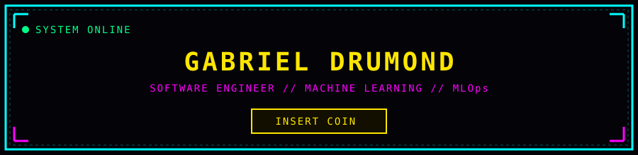
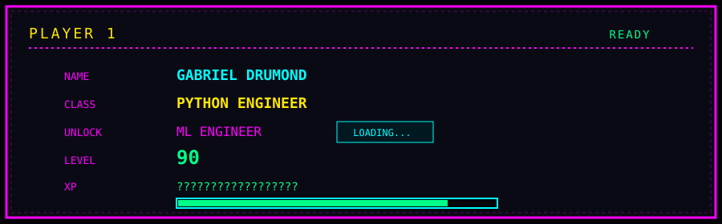
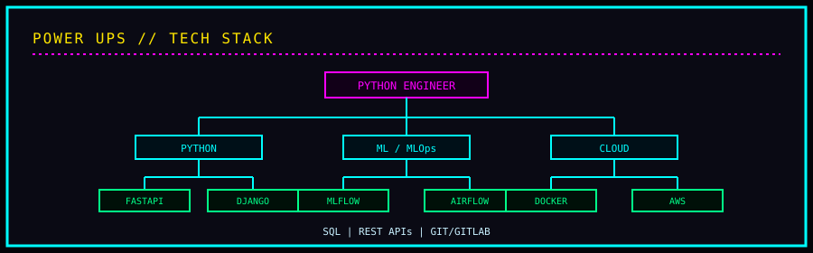
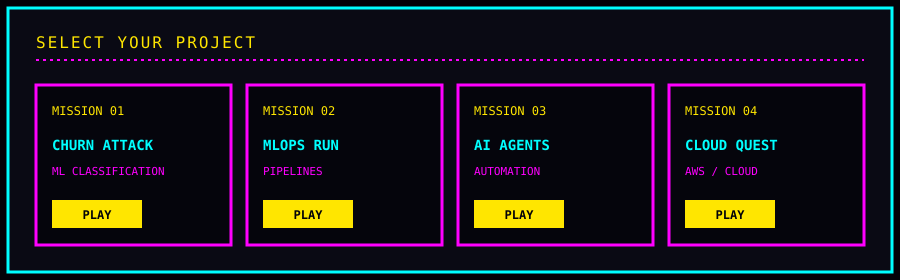
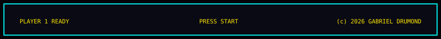

# 🕹️ GABRIEL DRUMOND // ARCADE

 

---

### 🎮 CONTROLS

| Button | Action |
|:---:|:---|
| **PLAY** | Open a project mission |
| **LOADING...** | ML Engineer unlock in progress |
| **PRESS START** | Talk to me |

### 📡 CONNECT

<!--
Lab HTML/CSS: index.html + assets/css/arcade.css
Profile render: this README (SVG/PNG only — GitHub limitation)
-->
