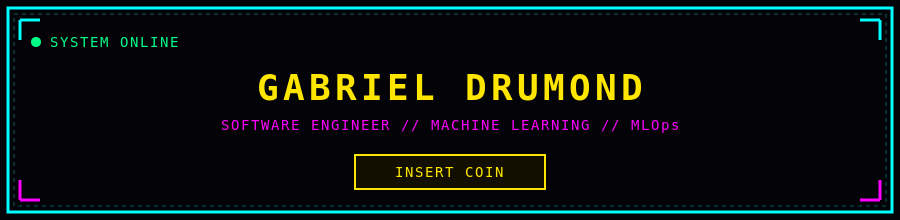
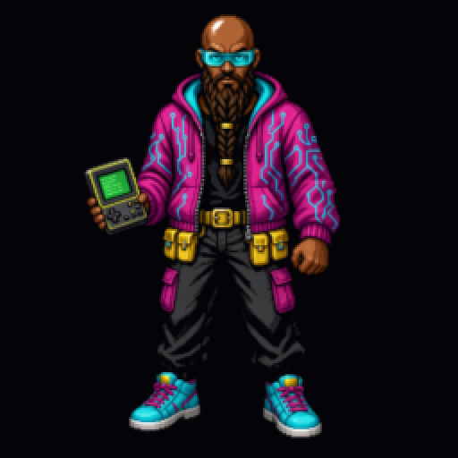
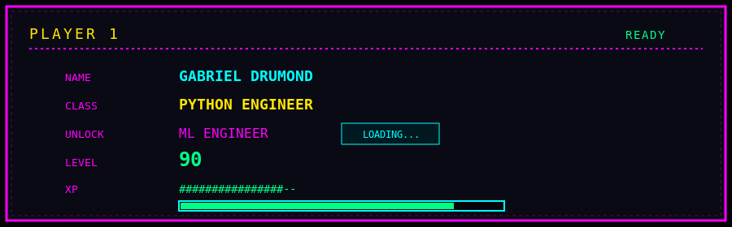
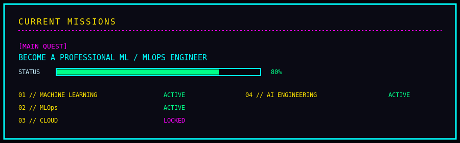
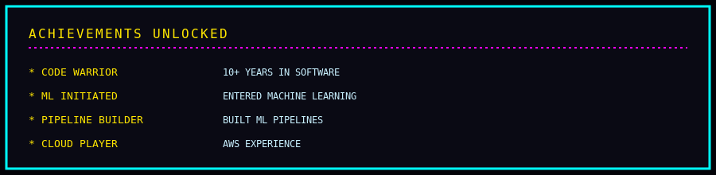
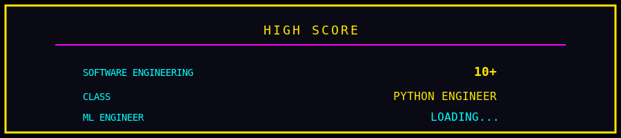
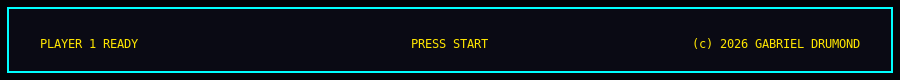

# GABRIEL DRUMOND // ARCADE

 

---

### CONTROLS

| Button | Action |
|:---:|:---|
| **PLAY** | Open a project mission |
| **LOADING...** | ML Engineer unlock in progress |
| **PRESS START** | Talk to me |

### CONNECT

